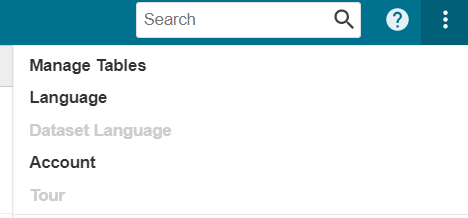
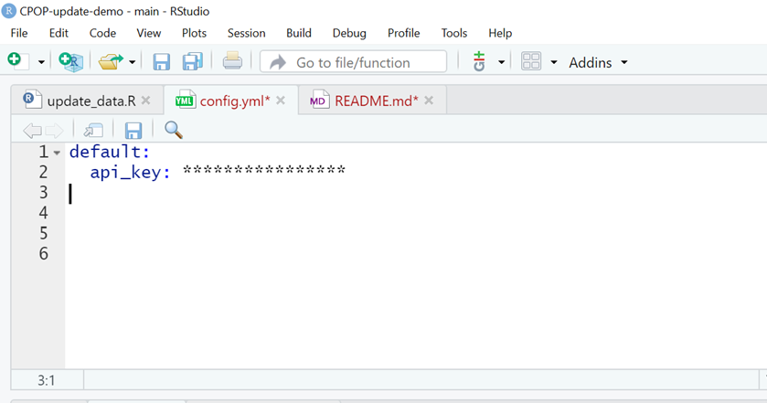

---
output:
  word_document: default
  html_document: default
  pdf_document: default
---
## Introduction

This repository demonstrates proposed improvements to the data pipeline for the CPOP dashboard. It obtains Local Authority level data for eleven datasets for nine indicators from five APIs. It then feeds this data into a mock-up of the 'CPP Over Time' tab of the [original dashboard](https://scotland.shinyapps.io/is-community-planning-outcomes-profile/) . 

## Dashboard Structure

The dashboard itself is created from three standard shiny scripts `global.R` `server.R` and `ui.R`. The data for this dashboard is generated entirely from APIs and compiled into one csv: _/cpop_data/masterdata_yyyy_mm_dd.csv_ which is read into the `global.R` file.

The scripts which obtain the data from APIs are within the _/data_update/API_queries_ folder and divided into three sub folders ( _/run_first_, _/run_second_ and _/run_third_ ), named to indicate the order in which they have to be run. This is important because some scripts depend on denominator data in the form of a csv output generated in another script. 

## Data by API

| Indicator | Dataset | Source | API | Cusom Package required? | Script Name
| ---       | ---     | ---    | --- |    --- | --- |
|Healthy Birthweight | Appropriate Birthweight for Gestational Age |<a href="https://www.opendata.nhs.scot/dataset/births-in-scottish-hospitals/resource/a5d4de3f-e340-455f-b4e4-e26321d09207" target="_blank"> PHS </a> |  <a href="https://www.opendata.nhs.scot/" target="_blank">PHS Open Data API</a> |  <a href="https://github.com/Public-Health-Scotland/phsopendata" target="_blank">phsopendata()</a> | run_second/healthy_birthweight.R |
|Primary 1 Body Mass Index | Clinical BMI at Council Area Level | <a href="https://www.opendata.nhs.scot/dataset/primary-1-body-mass-index-bmi-statistics/resource/4a3daa0f-1580-4a59-ac9e-64d9a31a4429" target="_blank"> PHS </a> | <a href="https://www.opendata.nhs.scot/" target="_blank">PHS Open Data API</a>  | <a href="https://github.com/Public-Health-Scotland/phsopendata" target="_blank">phsopendata()</a>  | run_second/primary_1_body_mass_index.R |
|Child Poverty | Numerator: Children in Low Income Families (Relative Low Income) | <a href="https://stat-xplore.dwp.gov.uk/webapi/jsf/login.xhtml" target="_blank"> Stat-Xplore </a>  | <a href="https://stat-xplore.dwp.gov.uk/webapi/online-help/Open-Data-API.html" target="_blank"> Stat-Xplore API </a>  |  <a href="https://github.com/houseofcommonslibrary/statxplorer" target="_blank"> statxplorer </a>  | run_second/child_poverty.R |
| | Denominator: Mid-Year Population Estimate (children aged 0-15) |<a href="https://statistics.gov.scot/resource?uri=http%3A%2F%2Fstatistics.gov.scot%2Fdata%2Frecorded-crime" target="_blank"> Statistics.gov.scot </a> | <a href="https://guides.statistics.gov.scot/category/37-api" target="_blank"> statistics.gov.scot API </a> | _none_ | run_first/under_16_population_cpp.R |
|Educational Attainment | Educational Attainment of School Leavers | <a href="https://statistics.gov.scot/data/educational-attainment-of-school-leavers" target="_blank"> statistics.gov.scot </a>  | <a href="https://guides.statistics.gov.scot/category/37-api" target="_blank"> statistics.gov.scot API </a>  | _none_ | run_second/educational_attainment.R |
|Employment Rate | Annual Population Survey - Employment Rate (16-64) | <a href="https://www.nomisweb.co.uk/datasets/apsnew" target="_blank"> Nomis </a> | <a href="https://www.nomisweb.co.uk/api/v01/help" target="_blank"> Nomis API </a> | _none_ | run_second/employment_rate.R |
|Out of Work Benefits | Numerator: Benefit Combinations (Out of Work) | <a href="https://stat-xplore.dwp.gov.uk/webapi/jsf/login.xhtml" target="_blank"> Stat-Xplore </a>  | <a href="https://stat-xplore.dwp.gov.uk/webapi/online-help/Open-Data-API.html" target="_blank"> Stat-Xplore API </a>  | <a href="https://github.com/houseofcommonslibrary/statxplorer" target="_blank"> statxplorer </a>  | run_second/out_of_work_benefits.R |
| | Denominator: Mid-Year Population Estimate (Working age 16-64) |<a href="https://statistics.gov.scot/resource?uri=http%3A%2F%2Fstatistics.gov.scot%2Fdata%2Frecorded-crime" target="_blank"> Statistics.gov.scot </a>| <a href="https://guides.statistics.gov.scot/category/37-api" target="_blank"> statistics.gov.scot API </a>  | _none_  | run_first/working_age_population_cpp.R |
| Median Pay | Annual Survey of Hours and Earnings (Table 8) | <a href="https://www.nomisweb.co.uk/datasets/ashe" target="_blank"> Nomis </a> | <a href="https://www.nomisweb.co.uk/api/v01/help" target="_blank"> Nomis API </a>| _none_ | run_second/median_pay.R |
| Crimes per 1000 population | Recorded Crimes and Offences | <a href="https://statistics.gov.scot/resource?uri=http%3A%2F%2Fstatistics.gov.scot%2Fdata%2Frecorded-crime" target="_blank"> Statistics.gov.scot </a> | <a href="https://guides.statistics.gov.scot/category/37-api" target="_blank"> statistics.gov.scot API </a>  | _none_ | run_second/crime_rate.R |
| Wellbeing | Annual Personal Wellbeing Estimates | <a href="https://www.ons.gov.uk/peoplepopulationandcommunity/wellbeing/datasets/headlineestimatesofpersonalwellbeing" target="_blank"> ONS </a> |<a href="https://developer.ons.gov.uk/" target="_blank"> ONS API </a> | <a href="https://github.com/kvasilopoulos/onsr" target="_blank"> onsr </a> | run_second/wellbeing.R |


*** 

## Data Update Steps 

### 1. Prepare Environment
Once you have [cloned](https://docs.github.com/en/repositories/creating-and-managing-repositories/cloning-a-repository)  this repository, in RStudio, in the console run:

  `install.packages("renv")`
  
and then:

  `renv::restore()`
  
to synchronize your package library with that in the lockfile to ensure package dependencies for this project are met. Note: if you are asked to run `renv::activate()`, do so.

### 2. Create config file

Go to File > New File > R Script (or Ctrl + Shift + N)
Copy and paste the code below within this new file.

```
default:
  api_key:

```
Save the file as 'config.yml' within the root directory of your version of this repositary (not in a sub folder). Click yes in response to the the pop up error **Confirm Change File Type**.

### 3. Get API Key
Log in/register to Stat-Xplore and go to Account (top right hand corner menu).



Under Open Data Access you will see your API Key. Click copy.

Go to the config.yml file and paste your raw API key next to `api_key:` ensuring you type ENTER then BACKSPACE after.

It should look like this:



Save and close this file.

### 4. Create up to date masterdata
Open the  _/data_update/update_data.R_ file.
Click anywhere in this script and hit Ctrl + Shift + Enter to run.
This script will automatically run each individual API query script (within _/data_update/API_queries_) in the correct order. This involves 11 successive API calls (so it might take a minute or two to complete), processing and merging the results, and writing this to a csv master data file. The _global.R_ code which depends on this output will automatically be updated with the appropriate file name reference.

Should you encounter an error running the _/data_update/update_data.R_ file. You can manually run the scripts in the  _/data_update/API_queries/_ folder one by one following the order dictated by the folder names: _/run_first_, _/run_second_ and _/run_third_ to find the issue.

### 5. Run the shiny app
Within any one of the _global.R_, _ui.R_, or _server.R_ scripts, click Run App (or click anywhere in script and hit Ctrl + Shift + Enter) see the dashboard with up to date data.


*** 
## Other Data Update Folders

#### make_nomis_uris
The _/data_update/make_nomis_uris/_ folder contains scripts which programatically extract parameter IDs from NOMIS dataset metadata which must be appended to the API endpoint URI (without which the response from the API is too large and is rate-limited at 25,000 observations). These script use the `nomir` package which can be found on [git hub](https://github.com/ropensci/nomisr). Any script which queries NOMIS has a corresponding make_nomis_uri script, but this is available solely to troubleshoot any problems should the API request return an error, and the data update process is not dependant on these.

#### json 
This folder contains json files which are read in and sent in the POST requests to stat-xplore.

#### look_ups
Some APIs return an S-Code for geography and some return council names. In order to ultimately match these, a geography code look-up csv is read in and joined to datasets which lack geography names. 

#### API_keys
The Stat-Xplore API requires authentication in the form of an API Key which is saved in this folder as a .txt file.

#### sparql
This folder contains SPARQL queries as txt files which are read into scripts which query the Statistics.gov.scot API. Storing them this way and reading them in as objects, keeps scripts tidy.

***

### SPARQL Queries
The [opendatascot](https://github.com/DataScienceScotland/opendatascot)  package was used to search metadata for the correct dimensions to filter a given dataset by. These dimensions were then passed, with the dataset ID, to the function `opendatascot::ods_print_query()` which generates tailored SPARQL queries. These did not return exact result required on every occasion, but provided a good starting point which coul be tweaked in the statistics.gov.scot [SPARQL editor](https://statistics.gov.scot/sparql-beta) . Then the adjusted SPARQL query, saved as a txt file, can be passed to the body of an HTTP POST request. There is no dependency on this package for the annual data update, but it is a valuable tool for generating and troubleshooting SPARQL queries.

***
